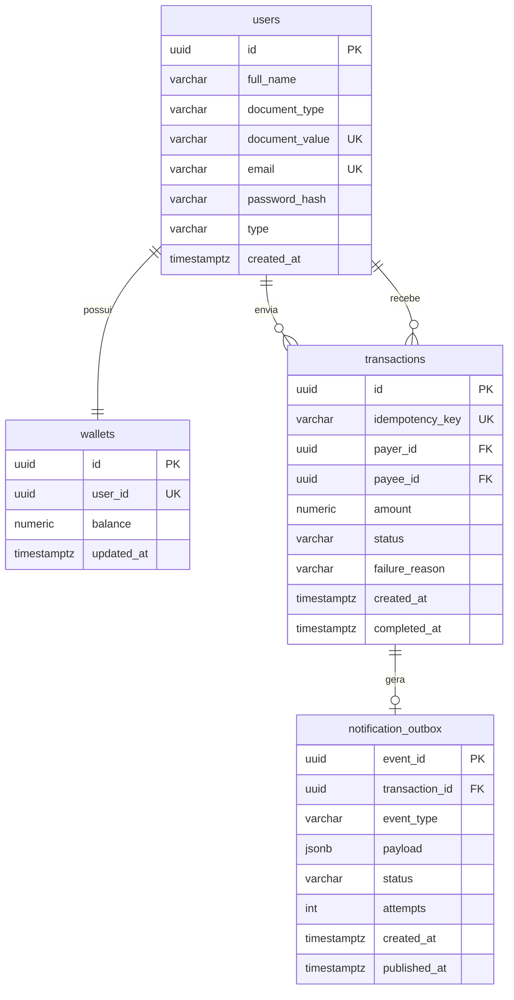

# Database Design — PicPay Simplificado

Define como os dados são persistidos: tabelas, colunas, constraints, índices e estratégia de concorrência.

Banco: **PostgreSQL**. Migrations: **Flyway** (`src/main/resources/db/migration`), conforme o padrão da arquitetura hexagonal.

Modelo de domínio: [domain-model.md](domain-model.md). Regras: [requirements.md](requirements.md).

Entidades JPA (futuras) ficam em `adapter/out/persistence/entity` e **não** são o modelo de domínio.

### Identificadores

PKs e FKs usam **UUID versão 7** (RFC 9562): 128 bits, ordenados por tempo, tipo PostgreSQL `uuid`. Não usar `BIGSERIAL`, UUID v4 nem ULID.

- Geração preferencial na **aplicação** (domínio / Hibernate `@UuidGenerator` v7), para o agregado nascer com id antes do INSERT.
- Alternativa no banco: `uuidv7()` (PostgreSQL 18+). **Não** usar `gen_random_uuid()` (é v4, insert aleatório no B-tree).
- Comparação (`<`, `ORDER BY`, `LEAST`) funciona: serve para lockar carteiras na mesma ordem e evitar deadlock.
- `id` da transação ≠ `Idempotency-Key` do cliente. A chave de idempotência é gerada pelo cliente (qualquer UUID estável, em geral v4) e não é a PK.
- O enunciado do desafio usa `payer`/`payee` numéricos; este projeto propõe UUID v7 no contrato HTTP (ver [api-spec.md](api-spec.md)).
- ULID foi considerado e descartado: mesmo benefício de ordem temporal, mas não é tipo nativo em Java (`java.util.UUID`) nem em PostgreSQL (`uuid`).

---

## 1. Diagrama relacional



---

## 2. Tabelas

### 2.1 `users`

Identidade do usuário comum ou lojista.

| Coluna           | Tipo         | Nulo | Default | Descrição |
|------------------|--------------|------|---------|-----------|
| `id`             | `UUID`       | não  | gerado na app (v7) | PK UUID v7. Mesmo tipo exposto em `payer` / `payee` na API. |
| `full_name`      | `VARCHAR(150)` | não |       | Nome completo. |
| `document_type`  | `VARCHAR(10)`  | não |       | `CPF` ou `CNPJ`. |
| `document_value` | `VARCHAR(14)`  | não |       | Somente dígitos, normalizado. |
| `email`          | `VARCHAR(255)` | não |       | Lowercase. |
| `password_hash`  | `VARCHAR(255)` | não |       | Hash (nunca senha em claro). |
| `type`           | `VARCHAR(20)`  | não |       | `COMMON` ou `MERCHANT`. |
| `created_at`     | `TIMESTAMPTZ`  | não | `now()` | |

Constraints:

```sql
PRIMARY KEY (id)
UNIQUE (document_value)
UNIQUE (email)
CHECK (document_type IN ('CPF', 'CNPJ'))
CHECK (type IN ('COMMON', 'MERCHANT'))
CHECK (
  (document_type = 'CPF'  AND char_length(document_value) = 11) OR
  (document_type = 'CNPJ' AND char_length(document_value) = 14)
)
```

Índices:

- `uk_users_document_value` (unique, já cobre busca por documento);
- `uk_users_email` (unique);
- `idx_users_type` em `type` (opcional; útil para relatórios, não para o hot path).

### 2.2 `wallets`

Uma carteira por usuário. O saldo vive aqui, não em `users`.

| Coluna       | Tipo          | Nulo | Default | Descrição |
|--------------|---------------|------|---------|-----------|
| `id`         | `UUID`        | não  | gerado na app (v7) | PK UUID v7. |
| `user_id`    | `UUID`        | não  |         | FK → `users.id`. |
| `balance`    | `NUMERIC(19,2)` | não | `0.00` | Saldo em BRL. |
| `updated_at` | `TIMESTAMPTZ` | não  | `now()` | Última movimentação. |

Constraints:

```sql
PRIMARY KEY (id)
UNIQUE (user_id)
FOREIGN KEY (user_id) REFERENCES users(id)
CHECK (balance >= 0)
```

Índices:

- `uk_wallets_user_id` (unique) — lookup por dono e garantia 1:1.

`NUMERIC(19,2)` evita erro de ponto flutuante em dinheiro. Não usar `DOUBLE PRECISION` / `FLOAT`.

### 2.3 `transactions`

Tentativa de transferência **e** reserva de idempotência. Sem tabela dedicada de idempotency keys.

| Coluna             | Tipo            | Nulo | Default | Descrição |
|--------------------|-----------------|------|---------|-----------|
| `id`               | `UUID`          | não  | gerado na app (v7) | PK UUID v7. Distinto de `idempotency_key`. |
| `idempotency_key`  | `VARCHAR(100)`  | não  |         | Header `Idempotency-Key` (obrigatório). Unique. Distinto do `id`. |
| `payer_id`         | `UUID`          | não  |         | FK → `users.id`. |
| `payee_id`         | `UUID`          | não  |         | FK → `users.id`. |
| `amount`           | `NUMERIC(19,2)` | não  |         | Valor da transferência. |
| `status`           | `VARCHAR(20)`   | não  |         | Ver enum abaixo. |
| `failure_reason`   | `VARCHAR(255)`  | sim  |         | Motivo quando `FAILED`. |
| `created_at`       | `TIMESTAMPTZ`   | não  | `now()` | Reserva / criação. |
| `completed_at`     | `TIMESTAMPTZ`   | sim  |         | Preenchido em `COMPLETED` ou `FAILED`. |

Constraints:

```sql
PRIMARY KEY (id)
UNIQUE (idempotency_key)
FOREIGN KEY (payer_id) REFERENCES users(id)
FOREIGN KEY (payee_id) REFERENCES users(id)
CHECK (payer_id <> payee_id)
CHECK (amount > 0)
CHECK (status IN ('IN_PROGRESS', 'AUTHORIZED', 'COMPLETED', 'FAILED', 'REVERSED'))
```

`idempotency_key` é `NOT NULL` + `UNIQUE`: toda transferência tem chave, e a mesma chave colide de forma atômica. Request sem header é rejeitado na API (`400`) e **não** chega a persistir.

Índices:

- `uk_transactions_idempotency_key` (unique);
- `idx_transactions_payer_id` em `payer_id`;
- `idx_transactions_payee_id` em `payee_id`;
- `idx_transactions_created_at` em `created_at DESC`;
- `idx_transactions_payer_created` em `(payer_id, created_at DESC)` — extrato, **limite diário (POL-03)** e **taxa por minuto (POL-04)** do `TransferPolicy`.

`payer_id`, `payee_id` e `amount` são o snapshot do payload: no replay, comparar esses três campos detecta chave reutilizada com corpo diferente. Não é necessário um `request_hash` extra neste recorte.

Consultas do `TransferPolicy` (application, não domínio), excluindo a transação atual:

```sql
-- POL-03: soma no dia civil (converter bounds para timestamptz em America/Sao_Paulo)
SELECT COALESCE(SUM(amount), 0)
  FROM transactions
 WHERE payer_id = :payerId
   AND id <> :currentId
   AND status IN ('IN_PROGRESS', 'COMPLETED')
   AND created_at >= :dayStart AND created_at < :dayEnd;

-- POL-04: quantidade na janela de 1 minuto
SELECT COUNT(*)
  FROM transactions
 WHERE payer_id = :payerId
   AND id <> :currentId
   AND status IN ('IN_PROGRESS', 'COMPLETED')
   AND created_at > :nowMinus1Minute;
```

### 2.4 `notification_outbox`

Transactional Outbox: o fato `TransferCompleted` é persistido **na mesma transação** do débito/crédito. Um publisher posterior lê pendências e publica no RabbitMQ.

Não substitui a fila. A outbox garante que o evento não se perde se o processo cair entre o `COMMIT` da transferência e o `publish`. O RabbitMQ desacopla o worker de notificação (retry / DLQ).

| Coluna           | Tipo          | Nulo | Default | Descrição |
|------------------|---------------|------|---------|-----------|
| `event_id`       | `UUID`        | não  | gerado na app (v7) | PK UUID v7 do evento (não é o `id` da transferência). |
| `transaction_id` | `UUID`        | não  |         | FK → `transactions.id`. |
| `event_type`     | `VARCHAR(80)` | não  |         | Ex.: `TransferCompleted`. |
| `aggregate_id`   | `VARCHAR(64)` | não  |         | `transaction_id` como texto (chave de ordenação). |
| `payload`        | `JSONB`       | não  |         | Corpo do evento. |
| `status`         | `VARCHAR(20)` | não  | `PENDING` | `PENDING`, `PUBLISHED`, `FAILED`. |
| `attempts`       | `INTEGER`     | não  | `0`     | Tentativas de publish. |
| `created_at`     | `TIMESTAMPTZ` | não  | `now()` | |
| `published_at`   | `TIMESTAMPTZ` | sim  |         | |

Constraints:

```sql
PRIMARY KEY (event_id)
FOREIGN KEY (transaction_id) REFERENCES transactions(id)
UNIQUE (transaction_id)   -- um evento de conclusão por transferência
CHECK (status IN ('PENDING', 'PUBLISHED', 'FAILED'))
CHECK (attempts >= 0)
```

Índices:

- `idx_notification_outbox_pending` em `(status, created_at)` WHERE `status = 'PENDING'` (partial index para o publisher);
- `uk_notification_outbox_transaction_id` (unique).

Em múltiplas réplicas da aplicação, o publisher deve claimar linhas com `FOR UPDATE SKIP LOCKED` para não publicar o mesmo evento em duplicidade. Consumidores da fila ainda podem ver o evento mais de uma vez (at-least-once); reenviar notify não altera saldo.

---

## 3. Por que não há tabela `idempotency_keys`

Só existe um endpoint transacional (`POST /transfer`). A chave e o estado (`IN_PROGRESS` / `COMPLETED` / `FAILED`) cabem em `transactions`.

Uma tabela dedicada faria sentido se vários endpoints precisassem da mesma infraestrutura. Hoje seria abstração sem uso.

---

## 4. Estratégia de concorrência

### 4.1 Idempotência (TOCTOU)

Errado: `SELECT` pela chave → se não existe, processa → `INSERT`. Duas requests lentas passam no check e debitam duas vezes.

Certo: o banco é o árbitro.

```text
1. INSERT INTO transactions (..., idempotency_key, status)
   VALUES (..., :key, 'IN_PROGRESS')

2a. INSERT ok → esta request "ganhou" a chave → segue o fluxo.

2b. INSERT falha com unique_violation
      SELECT * FROM transactions
       WHERE idempotency_key = :key
       FOR UPDATE          -- espera se a linha ainda estiver locked / IN_PROGRESS

      se payload (payer_id, payee_id, amount) != request atual
        → conflito de chave (HTTP 409)

      se status IN ('COMPLETED', 'FAILED')
        → replay da mesma resposta

      se status = 'IN_PROGRESS'
        → a primeira ainda não commitou o UPDATE final;
           o FOR UPDATE bloqueia até ela terminar;
           relê a linha e devolve o resultado
```

O `INSERT` com `UNIQUE` é atômico. A segunda request **espera** a primeira (lock de linha), não dispara um segundo débito. Em Java multithread isso ocupa uma thread/conexão por um intervalo curto (duração da transferência), aceitável neste recorte.

Não há request sem `Idempotency-Key`: o adapter web rejeita com `400` antes do `INSERT`.

### 4.2 Saldo (duas transferências do mesmo payer)

Dentro da transação de movimentação:

```sql
SELECT * FROM wallets WHERE user_id IN (:payerId, :payeeId)
FOR UPDATE;

-- revalida balance >= amount
UPDATE wallets SET balance = balance - :amount, updated_at = now() WHERE user_id = :payerId;
UPDATE wallets SET balance = balance + :amount, updated_at = now() WHERE user_id = :payeeId;
UPDATE transactions SET status = 'COMPLETED', completed_at = now() WHERE id = :id;
INSERT INTO notification_outbox (...);
COMMIT;
```

- `FOR UPDATE` serializa movimentações que tocam as mesmas carteiras.
- Revalidar saldo **depois** do lock (o autorizador externo rodou sem lock; o saldo pode ter mudado).
- `CHECK (balance >= 0)` é rede de segurança, não substitui a validação de negócio.
- Isolation level padrão (`READ COMMITTED`) + `FOR UPDATE` é suficiente. `SERIALIZABLE` não é necessário se os locks de linha estiverem corretos.

### 4.3 Ordem dos locks

Sempre lockar carteiras na **mesma ordem** (menor `user_id` primeiro; `UUID` é comparável) para reduzir deadlock quando A paga B e B paga A ao mesmo tempo.

### 4.4 Autorizador fora da transação de saldo

Não chamar o HTTP do autorizador com `FOR UPDATE` aberto. Fluxo:

```text
Tx curta: INSERT IN_PROGRESS → COMMIT
Valida usuários / tipo / valor (leituras)
GET autorizador
Tx de movimentação: lock wallets → debit/credit → COMPLETED + outbox → COMMIT
```

Se o autorizador recusar: `UPDATE transactions SET status = 'FAILED' ...` sem tocar em `wallets`.

---

## 5. Relação outbox × RabbitMQ

```text
Mesma transação de banco:
  UPDATE wallets (debit/credit)
  UPDATE transactions → COMPLETED
  INSERT notification_outbox (PENDING)
COMMIT

Depois:
  OutboxPublisher
    SELECT ... FROM notification_outbox WHERE status = 'PENDING'
    FOR UPDATE SKIP LOCKED
    publica no RabbitMQ
    marca PUBLISHED

Worker:
  consome fila
  POST https://util.devi.tools/api/v1/notify
  retry / DLQ
```

Não publicar direto no RabbitMQ de dentro da transação de dinheiro (não há XA). Não tratar a outbox como substituto da fila: a outbox é durabilidade do evento; a fila é desacoplamento e retry do notificador.

Não há tabela de idempotência do **consumo** da fila neste recorte: reenviar notify não move dinheiro.

---

## 6. Seed / dados de teste

Cadastro não é avaliado, mas a transferência precisa de usuários. Via Flyway seed (`V999__seed.sql` ou profile `local`):

- usuário comum A (saldo inicial, ex.: 1000.00);
- usuário comum B;
- lojista C.

IDs estáveis no seed (UUIDs fixos, documentados no README e em [api-spec.md](api-spec.md)) facilitam o teste manual do `POST /transfer`.

Exemplos usados na documentação:

| Papel | UUID v7 (seed) |
|-------|----------------|
| Usuário comum (payer) | `0190a1b2-c3d4-7000-8000-000000000004` |
| Lojista (payee) | `0190a1b2-c3d4-7000-8000-000000000015` |

---

## 7. Migrations Flyway

Ordem sugerida:

```text
V1__create_users.sql
V2__create_wallets.sql
V3__create_transactions.sql
V4__create_notification_outbox.sql
V5__seed_local.sql          -- somente profile local / teste, se separado
```

Regras:

- uma mudança estrutural por versão;
- nunca editar migration já aplicada;
- `hibernate.ddl-auto=validate` (ou `none`) em runtime; schema nasce do Flyway, não do Hibernate.

---

## 8. Notas de mapeamento JPA (implementação futura)

| Tabela                 | Entity JPA (adapter)        | Domain              |
|------------------------|-----------------------------|---------------------|
| `users`                | `UserJpaEntity`             | `User`              |
| `wallets`              | `WalletJpaEntity`           | `Wallet`            |
| `transactions`         | `TransactionJpaEntity`      | `Transaction`       |
| `notification_outbox`  | `NotificationOutboxJpaEntity` | (infra / outbox)  |

Enums persistidos como `STRING` (`@Enumerated(EnumType.STRING)`), nunca ordinal.

`Money.amount` ↔ `NUMERIC(19,2)`. Currency implícita BRL neste recorte.

IDs de domínio (`UserId`, `WalletId`, `TransactionId`) ↔ `java.util.UUID` (gerados como **v7**) ↔ coluna `UUID`. Não usar `Long` / `BIGSERIAL` / ULID / `UUID.randomUUID()` (v4) para PKs.
