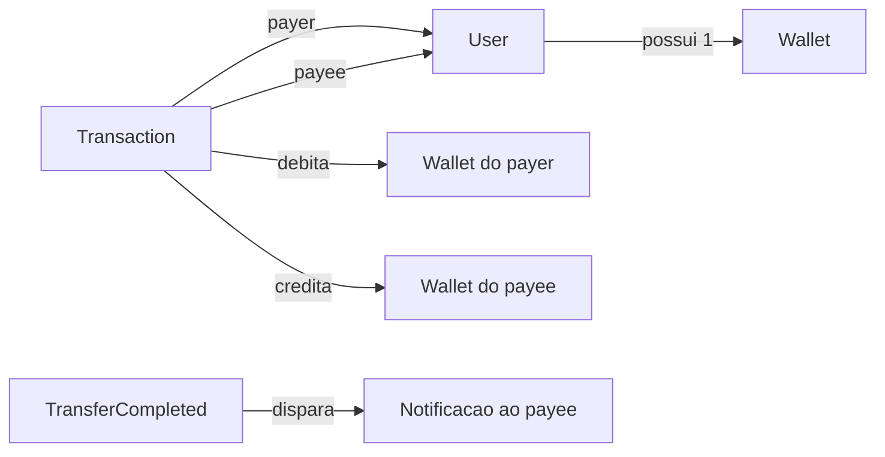

# Domain Model — PicPay Simplificado

Define como o negócio é modelado: entidades, relacionamentos, agregados, value objects, enums e eventos.

Este modelo é independente de Spring, JPA, HTTP e RabbitMQ. Na implementação futura, vive em `domain/model` conforme [ARCHITECTURE.md](../../spring-hexagonal-architecture/ARCHITECTURE.md). Persistência: [database-design.md](database-design.md). Regras: [requirements.md](requirements.md).

---

## 1. Visão geral



Agregados:

| Agregado      | Raiz        | Filhos / VOs              | Responsabilidade |
|---------------|-------------|---------------------------|------------------|
| User          | `User`      | `Document`, `Email`       | Identidade e tipo (comum/lojista). |
| Wallet        | `Wallet`    | `Money`                   | Saldo e movimentação de dinheiro. |
| Transaction   | `Transaction` | `Money`, `IdempotencyKey` | Tentativa de transferência e seu ciclo de vida. |

`User` e `Wallet` são agregados separados: a transferência coordena os dois via Application Service, sem o `User` carregar o saldo internamente. Isso evita um grafo grande e deixa o lock de saldo explícito na carteira.

---

## 2. Enums

### `UserType`

| Valor      | Significado | Pode ser payer | Pode ser payee |
|------------|-------------|----------------|----------------|
| `COMMON`   | Usuário comum | sim          | sim            |
| `MERCHANT` | Lojista       | não          | sim            |

### `TransactionStatus`

| Valor          | Significado |
|----------------|-------------|
| `IN_PROGRESS`  | Chave de idempotência reservada; processamento ainda não terminou. Estado transitório. |
| `AUTHORIZED`   | Autorizador externo aprovou; movimentação ainda não commitada (opcional na implementação; pode ir direto para `COMPLETED`). |
| `COMPLETED`    | Débito/crédito commitados. Fato consumado. |
| `FAILED`       | Tentativa recusada (saldo, permissão, autorizador, validação). Nenhum saldo alterado. |
| `REVERSED`     | Reserva para inconsistência pós-commit. No fluxo síncrono atual o rollback de banco cobre falhas antes do commit; o status existe para evolução. |

Transições válidas:

```text
IN_PROGRESS → AUTHORIZED → COMPLETED
IN_PROGRESS → COMPLETED
IN_PROGRESS → FAILED
COMPLETED   → REVERSED   (apenas em evolução / compensação futura)
```

Não há retorno de `FAILED` ou `COMPLETED` para `IN_PROGRESS`.

### `DocumentType`

| Valor  | Uso típico |
|--------|------------|
| `CPF`  | Usuário comum |
| `CNPJ` | Lojista |

O desafio trata "CPF/CNPJ" como documento único do usuário. O tipo discrimina o formato; a unicidade vale sobre o valor normalizado, independente do tipo.

---

## 3. Value objects

Imutáveis, com validação no construtor. Não são entidades JPA nem DTOs HTTP.

### `UserId`

Identificador do usuário: **UUID v7** (`java.util.UUID`). Exposto na API como `payer` / `payee`. O enunciado original usava inteiros; este projeto padroniza UUID v7.

### `WalletId`

Identificador da carteira: UUID v7.

### `TransactionId`

Identificador da transferência: UUID v7, gerado pelo servidor. Distinto de `IdempotencyKey` (gerada pelo cliente; não precisa ser v7).

### `Money`

Valor monetário.

```text
Money
  - amount: BigDecimal (scale 2)
  - currency: BRL (fixo neste recorte)
```

Invariantes:

- `amount` não nulo;
- `amount` > 0 quando representa valor de transferência;
- `amount` >= 0 quando representa saldo;
- operações `add` / `subtract` retornam novo `Money`;
- `subtract` que resultaria em negativo é inválido (`InsufficientBalanceException`).

### `Document`

```text
Document
  - type: DocumentType
  - value: String (somente dígitos, normalizado)
```

Invariantes:

- CPF: 11 dígitos;
- CNPJ: 14 dígitos;
- unicidade é regra de persistência, não só do VO.

### `Email`

```text
Email
  - value: String (normalizado em lowercase)
```

Formato válido e unicidade no sistema.

### `IdempotencyKey`

```text
IdempotencyKey
  - value: String (UUID textual recomendado)
```

Gerada pelo **cliente**, uma vez por tentativa lógica de pagamento. Reenviada igual em retries. Não é gerada pelo servidor. **Obrigatória** em toda transferência; o adapter web rejeita o request sem o header (`400`) antes do domínio.

---

## 4. Entidades

### 4.1 `User`

```text
User
  - id: UserId
  - fullName: String
  - document: Document
  - email: Email
  - passwordHash: String
  - type: UserType
```

Comportamento:

- `canSendMoney()` → `true` somente se `type == COMMON`.
- Não conhece saldo (saldo pertence a `Wallet`).

Invariantes:

- nome não vazio;
- documento e e-mail válidos;
- senha armazenada apenas como hash (o domínio não persiste senha em claro).

### 4.2 `Wallet`

```text
Wallet
  - id: WalletId
  - ownerId: UserId
  - balance: Money
```

Relação: **1 User : 1 Wallet**.

Comportamento:

- `debit(Money amount)` — falha se `balance < amount`;
- `credit(Money amount)` — soma ao saldo.

Invariantes:

- uma carteira por usuário;
- `balance >= 0` sempre;
- `ownerId` obrigatório.

### 4.3 `Transaction`

Agregado da tentativa de transferência. Também é o lugar da **reserva atômica de idempotência**.

```text
Transaction
  - id: TransactionId
  - idempotencyKey: IdempotencyKey    (obrigatória; gerada pelo cliente)
  - payerId: UserId
  - payeeId: UserId
  - amount: Money
  - status: TransactionStatus
  - failureReason: String?
  - createdAt: Instant
  - completedAt: Instant?
```

Fábrica:

- `Transaction.start(payerId, payeeId, amount, idempotencyKey)` → status `IN_PROGRESS`.
  - rejeita amount ≤ 0;
  - rejeita payerId == payeeId;
  - rejeita `idempotencyKey` nula ou em branco.

Comportamento:

- `complete()` → `COMPLETED` (somente a partir de `IN_PROGRESS` ou `AUTHORIZED`);
- `fail(reason)` → `FAILED` (somente a partir de `IN_PROGRESS`);
- `matchesPayload(payerId, payeeId, amount)` → usado no replay para detectar chave reutilizada com corpo diferente;
- `pullEvents()` → após `complete()`, emite `TransferCompleted`.

Invariantes:

- payer ≠ payee;
- amount > 0;
- `idempotencyKey` obrigatória e única no sistema (garantia de persistência + domínio).

---

## 5. Relacionamentos

```text
User (1) ────── (1) Wallet
User (1) ────── (*) Transaction as payer
User (1) ────── (*) Transaction as payee
```

- `Transaction` referencia `UserId`, não embarca `User` completo.
- Movimentação lê/escreve `Wallet` do payer e do payee na mesma operação de aplicação.
- Não há entidade `Notification` no domínio: notificar é efeito colateral após o fato `TransferCompleted`.

---

## 6. Invariantes críticos (checklist)

1. Lojista nunca é `payer`.
2. Saldo da carteira nunca é negativo.
3. Transferência com valor ≤ 0 é inválida.
4. Payer e payee existem e são distintos.
5. Transferência só vira `COMPLETED` depois da autorização externa e do débito/crédito atômicos.
6. `FAILED` não altera saldo.
7. A mesma `IdempotencyKey` não inicia duas movimentações.
8. Replay com a mesma chave e o mesmo payload devolve o mesmo resultado de negócio.
9. Replay com a mesma chave e payload diferente é rejeitado (não é a mesma tentativa lógica).
10. A transferência respeita `TransferPolicy` (teto, horário noturno, limite diário, taxa por minuto).

---

## 7. Eventos de domínio

Eventos representam **fatos no passado**. Não conhecem tópico, fila, RabbitMQ nem HTTP.

### `TransferCompleted`

Emitido quando a transação entra em `COMPLETED`.

```text
TransferCompleted
  - transactionId
  - payerId
  - payeeId
  - amount
  - occurredAt
```

Uso: após o commit, a aplicação grava o evento na outbox; o publisher envia ao RabbitMQ; o worker de notificação avisa o payee.

Não emitir notificação a partir de `FAILED`. Não emitir evento de domínio para “tentativa iniciada” neste recorte.

### Eventos conscientemente adiados

- `TransferFailed` — útil para auditoria; não dispara notificação de pagamento.
- `WalletDebited` / `WalletCredited` — granular demais para o recorte.

---

## 8. Exceções de domínio

Não carregam status HTTP. O adapter web traduz para `ProblemDetail`.

| Exceção                         | Quando |
|---------------------------------|--------|
| `MerchantCannotSendMoneyException` | Lojista como payer. |
| `InsufficientBalanceException`  | Saldo do payer < amount. |
| `InvalidTransferAmountException`| Valor ≤ 0. |
| `SameAccountTransferException`  | Payer = payee. |
| `UserNotFoundException`         | Payer ou payee inexistente. |
| `WalletNotFoundException`       | Usuário sem carteira. |
| `TransferNotAuthorizedException`| Autorizador recusou. |
| `TransferAmountLimitExceededException` | Valor acima do teto (R$ 20.000, ou R$ 5.000 à noite). |
| `DailyTransferLimitExceededException` | Soma do dia do payer + valor > R$ 80.000. |
| `TransferRateLimitExceededException` | Mais de 5 transferências do payer em 1 minuto. |
| `IdempotencyKeyConflictException` | Mesma chave, payload diferente. |
| `InvalidDocumentException`      | CPF/CNPJ inválido. |
| `InvalidEmailException`         | E-mail inválido. |
| `InvalidMoneyException`         | Money malformado. |

---

## 9. Domain service — `TransferPolicy`

`domain/service/TransferPolicy`: regras internas de limite. **Não acessa banco, HTTP nem relógio de sistema direto** — recebe um snapshot e um `Clock`/`Instant` já resolvidos pela application.

A regra “lojista não envia” continua em `User.canSendMoney()`.
A regra de saldo continua em `Wallet.debit()`.
Autorizador externo, outbox e persistência continuam na **Application Service**.

### 9.1 Constantes (política atual)

Timezone: `America/Sao_Paulo`.

| Constante | Valor |
|-----------|-------|
| `MAX_TRANSFER_AMOUNT` | 20.000,00 |
| `NIGHT_MAX_TRANSFER_AMOUNT` | 5.000,00 |
| `NIGHT_START` | 22:00 (inclusive) |
| `NIGHT_END` | 06:00 (exclusive) |
| `DAILY_LIMIT` | 80.000,00 |
| `RATE_LIMIT_MAX` | 5 |
| `RATE_LIMIT_WINDOW` | 1 minuto |

Horário noturno: `hour >= 22 || hour < 6` no fuso acima. Às 06:00:00 vale o teto diurno (R$ 20.000).

### 9.2 Snapshot (entrada)

A application carrega e monta:

```text
TransferPolicySnapshot
  - amount: Money
  - occurredAt: Instant
  - zone: America/Sao_Paulo
  - payerSpentToday: Money          // soma IN_PROGRESS + COMPLETED no dia civil, sem a tx atual
  - payerTransfersInLastMinute: int // quantidade IN_PROGRESS + COMPLETED na janela, sem a tx atual
```

`FAILED` não entra nas contas.

### 9.3 Avaliação

```text
TransferPolicy.assertAllowed(snapshot)

1. amount > 20.000                         → TransferAmountLimitExceededException
2. isNight(occurredAt) && amount > 5.000   → TransferAmountLimitExceededException
3. payerSpentToday + amount > 80.000       → DailyTransferLimitExceededException
4. payerTransfersInLastMinute >= 5         → TransferRateLimitExceededException
```

POL-01 e POL-02 não precisam de persistência (só valor + relógio). POL-03 e POL-04 precisam do snapshot. Ordem sugerida de implementação: 1 → 2 → 3 → 4.

### 9.4 Corrida (limites de taxa/diário)

Duas requests paralelas do mesmo payer podem passar no snapshot ao mesmo tempo e furar de leve POL-03/POL-04. Aceitável neste recorte (best-effort). Garantia forte exigiria lock por payer — evolução, não requisito agora.

Replay idempotente não chama `TransferPolicy` de novo.

---

## 10. Mapeamento para a implementação hexagonal

```text
domain/model/          User, Wallet, Transaction, Money, Document, Email, ...
domain/enums/          UserType, TransactionStatus, DocumentType
domain/event/          TransferCompleted
domain/exception/      exceções da seção 8
domain/service/        TransferPolicy

application/service/   TransferService (orquestra ports + domínio + política)
application/port/out/  UserRepository, WalletRepository, TransactionRepository,
                       AuthorizationPort, OutboxPort, ClockPort, ...
```

Adapters (web, JPA, RabbitMQ, Feign/WebClient) **não** entram no domínio.
